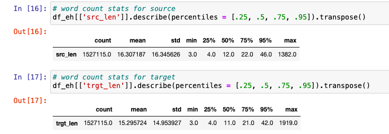
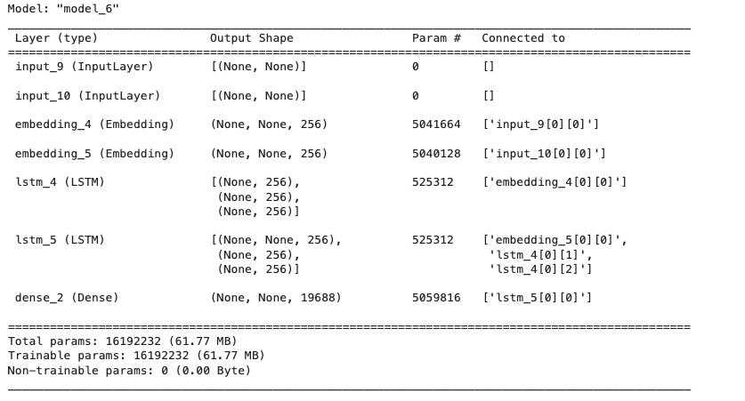
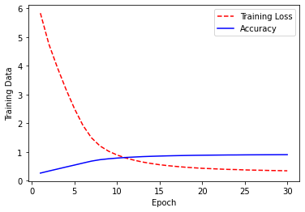
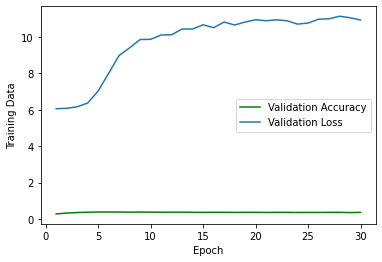

# 6140-Neural-Machine-Translation

## Neural Machine Translation model for bi-lingual conversation using LSTM and Transformers

#### Contributors - Eshan Wadhwa, Prabhleenkaur Bindra

#### Project Report - https://docs.google.com/document/d/1K8CwiZLsZfoJK_sdZo2FfMqJPhIJBdftFUdAWOXtqkk/edit

### Abstract Overview
Natural language processing (NLP) has got great development with deep learning techniques. In the sub-field of machine translation, a new approach named Neural Machine Translation (NMT) has emerged and gotten massive attention from both academia and industry. Our aim with the project has been to understand the working of various machine learning algorithms (esp Neural Networks), their architecture and impact on accuracy for translating data from one language to another. We worked with LSTM(Long Short Term Memory) RNNs and Transformers with attention. Our focus majorly has been with LSTMs due to their short training time, while we worked around working with Transformers to understand their impact on machine translation. Per our initial analysis, we realized that Transformers in general take a lot of time to train and learn while providing better accuracy while working towards machine translation, where attention is the key. This state-of-the-art algorithm is an application of deep learning in which massive datasets of translated sentences are used to train a model capable of translating between any two languages. One of the older and more established versions of NMT is the Encoder Decoder structure. This basically is two RNN models, one which encodes the source language while the other decoding the tokens(encoded vectors) to the respective target language. When coupled with the power of attention mechanisms, this architecture can achieve impressive results as we discuss through this project.

### Environment Setup
The basic libraries and dependencies require to set the project up include:

nltk - for tokenizing and calculating bleu score
keras - to set and train LSTM model
datasets(to load datasets from Hugging Face) - To load and use dataset and pretrained model from hugging face
Numpy, pandas, re and string for data preprocessing
Matplotlib - to chart and plot results
Tensorflow - in order to convert our raw data into tensors for tokenizing later.
Transformers - to load and check transformer pre-trained model(Helsinki-NLP/opus-mt-en-hi)

### Prepare datasets - 

#### Data Statistics:

Based on the raw data we received, we ran a basic statistical model to analyse and choose an appropriate length for each of the sentences. As per the data that we received, we chose 10 to be the average length since 50% of our data had this length. Choosing a higher length, the computational efficiency and the training time of the model would increase and would lead to inefficiencies. 

#### Preprocessing
Major of our project involved understanding, preprocessing and tokenizing our dataset. The initial raw dataset that we used was from Hugging face (https://huggingface.co/datasets/cfilt/iitb-english-hindi) comprising 1.66 mn training records and 2.51K test records. 

We preprocess, remove extra punctuations, strip data and remove foreign words from our language model. Our raw data is extracted as a dictionary which we extract into lists termed eng_sen (english sentence) and hin_sen (hindi sentence) for ease of reference.

Our aim was to extract sentences with length 10 understanding the complexity of data and managing the training of the dataset. We thus first filtered our data upon this metric. Post this we added the <START> and <END> token for each of the sentences. If the sentence length after adding these tokens was <10, we added padding at the end of each of these sentences.

#### Creating the vocabulary

To create a comprehensive vocabulary from our filtered dataset, we utilize a Tokenizer library. This tool breaks down the text into tokens and assigns unique numerical identifiers to each token, forming the vocabulary. Following vocabulary creation, we proceed to convert text sequences into numerical representations using tokenization.

In the process of preparing inputs for the encoder, we apply padding at the end of each sentence, denoted by padding='post'. This choice of padding is particularly significant for neural network architectures, such as recurrent neural networks (RNNs) or transformers, where inputs must have a consistent length.

Padding plays a crucial role in ensuring uniform input lengths, facilitating the construction of batches for efficient training. It is essential for creating a structured neural network that handles inputs consistently. The structured architecture becomes particularly relevant for models with a decoder, as it enables the network to provide even inputs and receive corresponding outputs.

In summary, by incorporating padding at the end of sentences, we not only establish a consistent input structure but also contribute to the efficient training and convergence of the neural network, especially in architectures involving a decoder.

Finally after preprocessing is complete we split our dataset into training and test with 95% of the preprocessed data being used for training while 5% is used for testing and calculating BLEU score.

### Loading the model
We designed a Long Short-Term Memory (LSTM) model for sequence-to-sequence translation tasks, focusing on language translation from English to Hindi. The model architecture comprises an encoder-decoder structure, a widely used paradigm for handling sequential data.

The encoder processes the input sequences (English sentences) and extracts meaningful representations. Key components of the encoder include:

Embedding Layer: This layer converts the input tokens into dense vectors, facilitating the neural network's understanding of word relationships.
LSTM Layer: Utilizing Long Short-Term Memory cells, the encoder captures contextual information from the input sequences. The LSTM layer returns the final hidden state (state_h) and the cell state (state_c) for subsequent use in the decoder.

The decoder generates the target sequences (Hindi translations) based on the encoded information. Notable elements of the decoder include:

Embedding Layer: Similar to the encoder, this layer transforms the target tokens into dense vectors.
LSTM Layer: The decoder LSTM processes the embedded target sequences while considering the context provided by the encoder. It returns sequences of outputs and the final states.

A Dense layer with a softmax activation function is employed to produce probability distributions over the Hindi vocabulary. This allows the model to predict the most likely Hindi token for each position in the output sequence.

The model is compiled using the Adam optimizer and Sparse Categorical Cross Entropy as the loss function. The choice of the optimizer and loss function is motivated by their effectiveness in sequence-to-sequence tasks. The model is configured to optimize for accuracy during training.

### Training the model
Below describes our model’s training and validation sets accuracy vs loss curves over 30 epochs:

We observe that in over 30 epochs we receive an accuracy of around 91% while the epoch loss also considerably reduces using LSTMs.
	
The notebook also has experimental results of training and validation accuracy vs loss for 20, and 50 epochs respectively with varying amounts of training set size for us to analyze and conclude the BLEU scores.
Model Comparison and Analysis 
LSTM vs. Pretrained Transformer
To benchmark the performance of our LSTM-based sequence-to-sequence model, we conducted a comparative analysis with a pretrained Transformer model(Helsinki-NLP/opus-mt-en-hi) obtained from Hugging Face, specifically trained on the Opus dataset. Given the nature of the Transformer architecture, which excels in capturing long-range dependencies through attention mechanisms, we anticipated superior results.

The BLEU (Bilingual Evaluation Understudy) score is a metric commonly used to evaluate the quality of machine-generated translations in Natural Language Processing (NLP), particularly in the context of Neural Machine Translation (NMT). BLEU was designed to align with human intuition about translation quality and has become a standard metric for comparing the performance of different translation models. BLEU evaluates the precision of the generated translation by comparing it to one or more reference translations. It considers n-grams (contiguous sequences of n items, typically words) in the generated translation and checks how many of these n-grams are also present in the reference translation.

Surprisingly, our findings indicate that the LSTM model performed remarkably well in comparison, demonstrating similar levels of accuracy and achieving competitive BLEU scores. Despite the architectural differences, the LSTM model proved to be robust in capturing contextual information and generating coherent translations. This suggests that for certain language translation tasks, the inherent capacity of LSTMs to capture sequential dependencies might be on par with the attention mechanisms employed by Transformers.

The pretrained Transformer model, while undoubtedly powerful and capable of capturing intricate details, did not exhibit a substantial performance advantage in our specific task. This observation underscores the importance of task-specific evaluations and the nuanced nature of model comparisons. Our results encourage further exploration into the effectiveness of traditional recurrent architectures like LSTMs, particularly in scenarios where pretrained models might not necessarily outperform their sequential counterparts.

This LSTM-based sequence-to-sequence model serves as a powerful tool for English-to-Hindi language translation. The detailed architecture, training configuration, and evaluation metrics establish a foundation for further experimentation and improvements.

Our work shows that for a small sample of 100 test sentences the BLEU score was 0.8 for Transformers and 0.89 for LSTMs which indicates a good start and is comparable with that of google translate. 

### Future Work
Our aim with this project is to take this further with training bidirectionally for hindi and english. We look towards improving our accuracy, working with transformers and achieving a consistent state in order to work with more data. We also look towards expanding this project to include a third language where the model understands the introduction of the third language and is able to translate from hindi to the third language using english as the middleware decoder. In order to achieve this, we are building confidence on translating from hindi to english with an accuracy of 95% or higher.

### References

- https://medium.com/geekculture/english-to-hindi-text-translation-using-marianmt-models-from-huggingface-187b4719809e

- https://towardsdatascience.com/neural-machine-translation-15ecf6b0b

- https://huggingface.co/datasets/cfilt/iitb-english-hindi

- https://huggingface.co/damerajee/hindi-english
- https://www.tensorflow.org/api_docs/python/tf/keras/preprocessing/text/Tokenizer
- https://www.tensorflow.org/api_docs/python/tf/keras/utils/pad_sequences
- https://www.tensorflow.org/api_docs/python/tf/keras/losses/SparseCategoricalCrossentropy
- https://keras.io/api/layers/core_layers/dense/
